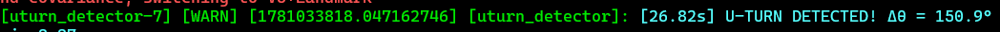
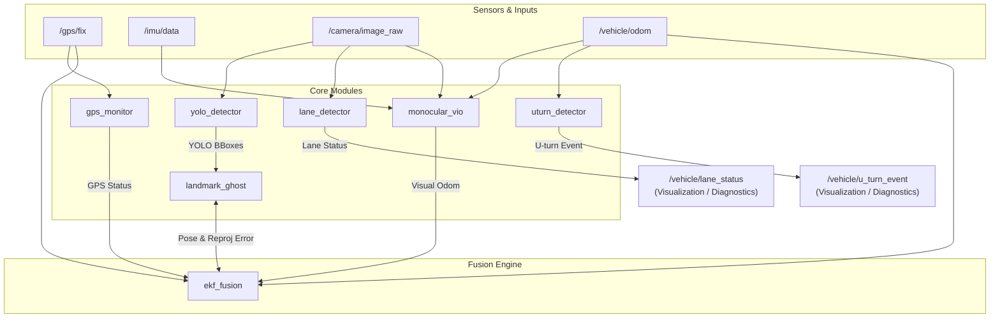
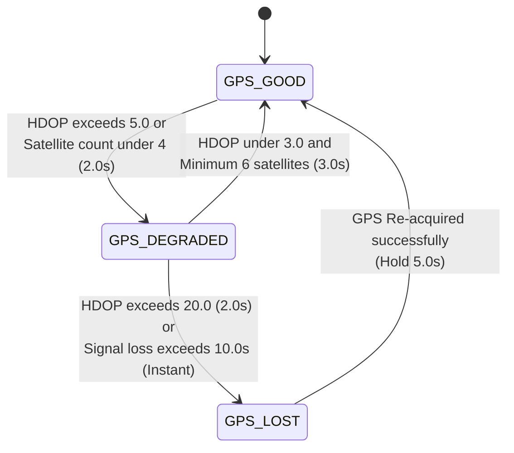

# 🚗 GPS-Degraded Localization System

A high-accuracy backup localization system fully optimized for **CPU** (CPU-Optimized), designed specifically to operate on electric vehicle edge devices when traveling into areas where GPS signals are severely degraded or completely lost (underground supermarket parking lots, multi-level parking structures, urban canyons, or under dense tree canopies).

The system automatically performs real-time GPS signal quality monitoring, activates parallel dead-reckoning (Visual Odometry / Wheel Odometry), and executes a seamless handover to vision-based positioning utilizing a 3D Landmark Database (Landmark-based Correction) integrated via an Extended Kalman Filter (EKF).

---

<p align="center">
  
  
</p>

---

## 🗺️ 1. System Architecture

The system consists of several core ROS 2 nodes running entirely on CPU, communicating asynchronously via standard ROS 2 topics:



### 📋 Connection Channels (Topics & Message Types):

| Data Stream | From Node | To Node | ROS 2 Topic | Message Type |
| :--- | :--- | :--- | :--- | :--- |
| **GPS Fix** | GPS Sensor | `gps_monitor` / `ekf_fusion` | `/gps/fix` | `sensor_msgs/msg/NavSatFix` |
| **IMU Data** | IMU Sensor | `monocular_vio` | `/imu/data` | `sensor_msgs/msg/Imu` |
| **Camera Raw** | Camera Sensor | `yolo_detector` / `lane_detector` / `monocular_vio` | `/camera/image_raw` | `sensor_msgs/msg/Image` |
| **Wheel Odom** | EV CAN Bus | `ekf_fusion` / `monocular_vio` / `uturn_detector` | `/vehicle/odom` | `nav_msgs/msg/Odometry` |
| **GPS Status** | `gps_monitor` | `ekf_fusion` | `/gps/status` | `std_msgs/msg/String` |
| **Visual Odom** | `monocular_vio` | `ekf_fusion` | `/vo/odom` | `nav_msgs/msg/Odometry` |
| **YOLO BBoxes** | `yolo_detector` | `landmark_ghost` | `/detection/bboxes` | `vision_msgs/msg/Detection2DArray` |
| **Lane Status** | `lane_detector` | Visualization / EV Controller | `/vehicle/lane_status` | `std_msgs/msg/String` |
| **U-turn Event** | `uturn_detector` | Visualization / EV Controller | `/vehicle/u_turn_event` | `std_msgs/msg/String` |
| **Pose & Reproj Error** | `landmark_ghost` $\Leftrightarrow$ `ekf_fusion` (Feedback Loop) | `landmark_ghost` $\Leftrightarrow$ `ekf_fusion` | `/landmark/reprojection_error` <br> `/ekf/pose` | `geometry_msgs/msg/PoseWithCovarianceStamped` <br> `geometry_msgs/msg/PoseStamped` |

---

### Core Node Responsibilities:
*   [gps_monitor.py](ev_localization/ev_localization/gps_monitor.py): Monitors GPS signal quality in real-time by tracking HDOP and satellite counts. Implements a Hysteresis State Machine to classify 3 states: `GPS_GOOD`, `GPS_DEGRADED`, and `GPS_LOST`.
*   [yolo_detector.py](ev_localization/ev_localization/yolo_detector.py): Identifies static roadside objects (parked vehicles) to serve as mapping landmarks using YOLOv8n (ONNX Runtime, running purely on CPU).
*   [lane_detector.py](ev_localization/ev_localization/lane_detector.py): Detects lane markers using Canny edge filtering and Hough line transform, estimating lateral deviation to identify if the vehicle is in the left, right, or center of the lane.
*   [uturn_detector.py](uturn_detector.py): Integrates yaw rate angular velocity from IMU in a sliding window to quickly detect U-turn events within 2 seconds.
*   [landmark_ghost.py](ev_localization/ev_localization/landmark_ghost.py): Projects 3D landmarks (Ghost Projection) from the database onto the 2D image plane based on the EKF's current predicted pose, performing semantic class matching against YOLO bounding boxes to output reprojection errors.
*   [ekf_fusion.py](ev_localization/ev_localization/ekf_fusion.py): Extended Kalman Filter (EKF) engine fusing IMU, Wheel Odometry, GPS, and Landmark data. Publishes the estimated pose and final trajectory path of the vehicle at 20 Hz.

---

## 🧠 2. Core Logic & Localization Algorithms

### 2.1 GPS Integrity Monitor & Handover Logic
To prevent rapid toggling (flickering) at signal boundaries when the GPS signal fluctuates, the system implements a **Hysteresis State Machine** with specific duration thresholds:



*   **Transition Delay (degraded to lost):** When HDOP exceeds the lost threshold (>20.0), the system still maintains a Hysteresis delay (`hysteresis_duration_sec` = 2.0s) to avoid reacting to transient noise. However, if there is a complete loss of signal (no GPS fix message received) exceeding `timeout_sec` (10s), the system transitions to `GPS_LOST` instantly.
*   **Coordinate Latching on GPS Loss:** When the state transitions to `GPS_LOST`, the system latches the last high-confidence WGS84 coordinate of the vehicle and its corresponding covariance matrix:
    ```math
    \mathbf{x}_{\text{latch}} = \mathbf{x}_{t_{\text{last\_good}}}, \quad \mathbf{P}_{\text{latch}} = \mathbf{P}_{t_{\text{last\_good}}}
    ```
    From this point onward, the EKF disables all updates from the GPS and switches entirely to local dead-reckoning and visual landmark updates. These latched variables are used to analyze handover latency.
*   **Seamless Coordinate Handover:** The system maintains a local origin frame (`odom`). The EKF stores the initial yaw offset `initial_yaw` to rotate GPS ENU (East-North-Up) coordinates into alignment with the local odom frame from $t=0$:
    ```math
    \mathbf{p}_{\text{local}} = \mathbf{R}(-\theta_{\text{initial}}) \cdot \mathbf{p}_{\text{ENU}}
    ```
    This ensures that when GPS signal is lost or re-acquired, the trajectory does not experience coordinate jumps or heading rotation discontinuities.

### 2.2 Extended Kalman Filter (EKF)
The EKF estimates a 2D state vector of the electric vehicle: $\mathbf{x} = [x, y, \theta]^T$, where $x, y$ are Cartesian coordinates in the local frame and $\theta$ is the heading.

#### A. Predict Step
Motion integration uses Mid-point Integration from Wheel Odometry (linear velocity $v$, angular velocity $\omega$):
```math
\theta_{\text{mid}} = \theta_{k-1} + \omega \frac{dt}{2}
```
```math
\mathbf{x}_k^- = \begin{bmatrix} x_{k-1} + v dt \cos(\theta_{\text{mid}}) \\ y_{k-1} + v dt \sin(\theta_{\text{mid}}) \\ \theta_{k-1} + \omega dt \end{bmatrix}
```

Motion Jacobian $F_k$:
```math
F_k = \begin{bmatrix} 1 & 0 & -v dt \sin(\theta_{\text{mid}}) \\ 0 & 1 & v dt \cos(\theta_{\text{mid}}) \\ 0 & 0 & 1 \end{bmatrix}
```

**Process Noise Discretization:**
To ensure mathematical correctness across variable sensor rates, the continuous-time process noise covariance $Q_c$ is discretized dynamically according to the sampling period $dt$:
```math
Q_d = Q_c \cdot dt = \text{diag}(q_x, q_y, q_{\theta}) \cdot dt
```
```math
\mathbf{P}_k^- = F_k \mathbf{P}_{k-1} F_k^T + Q_d
```

#### B. Update Step
The update step depends on the GPS status received from the Monitor:
1.  **`GPS_GOOD` mode:** Measures $\mathbf{z}_k^{\text{GPS}} = [x_{\text{gps}}, y_{\text{gps}}]^T$. Measurement matrix $H = \begin{bmatrix} 1 & 0 & 0 \\ 0 & 1 & 0 \end{bmatrix}$. Noise covariance $R = R_{\text{gps}}$.
2.  **`GPS_DEGRADED` mode:** EKF runs in parallel with visual landmark updates, while scaling the GPS measurement noise covariance up by 3x to reduce its confidence weight:
    ```math
    R = 3.0 \cdot R_{\text{gps\_default}}
    ```
3.  **`GPS_LOST` mode:** The system completely disables GPS updates and relies solely on visual Landmark updates.

#### C. Covariance Clamping
During long GPS outages, the covariance matrix $\mathbf{P}$ tends to grow unboundedly. The system normalizes and clamps the diagonal elements of $\mathbf{P}$ to a parameterized `max_covariance` limit while preserving the correlation structure:
```math
\text{If } \mathbf{P}_{i,i} > P_{\text{max}} \implies \text{scale} = \sqrt{\frac{P_{\text{max}}}{\mathbf{P}_{i,i}}}
```
```math
\mathbf{P}_{i,*} \leftarrow \mathbf{P}_{i,*} \cdot \text{scale}, \quad \mathbf{P}_{*,i} \leftarrow \mathbf{P}_{*,i} \cdot \text{scale}
```

---

### 2.3 Landmark-based Correction (Visual Update)
When the camera detects a landmark (static vehicle), the `landmark_ghost` node matches it against the 3D landmark database to construct a reprojection error measurement.

#### A. Ghost Projection
Landmark $L_i$ has 3D coordinates in the ENU frame $\mathbf{p}_{\text{3D}} = [L_x, L_y, L_z]^T$. Given the predicted robot pose $\mathbf{x}_k^- = [x, y, \theta]^T$, the landmark is transformed into the camera frame using camera extrinsics $T_{\text{bc}}$ (extrinsic parameters):
```math
\mathbf{p}_{\text{camera}} = \mathbf{T}_{cw}(\mathbf{x}_k^-) \cdot \begin{bmatrix} L_x \\ L_y \\ L_z \\ 1 \end{bmatrix} = \begin{bmatrix} X_c \\ Y_c \\ Z_c \\ 1 \end{bmatrix}
```

Using the pinhole camera model, it is projected onto the 2D image plane:
```math
u = f_x \frac{X_c}{Z_c} + c_x, \quad v = f_y \frac{Y_c}{Z_c} + c_y
```

#### B. Reprojection Error & EKF Update
The difference between the actual YOLO bounding box center $(u_{det}, v_{det})$ and the projected ghost point $(u, v)$ forms the EKF measurement:
```math
\mathbf{z}_k^{\text{landmark}} = \begin{bmatrix} u_{\text{det}} - u \\ v_{\text{det}} - v \end{bmatrix}
```

Since the camera projection model is highly non-linear, the measurement Jacobian $H_{\text{landmark}}$ is computed using the **Numerical Jacobian** method with $\epsilon = 10^{-5}$:
```math
H_{\text{landmark}}[:, j] = \frac{\text{Project}(\mathbf{p}_{3D}, \mathbf{x} + \epsilon \cdot \mathbf{e}_j) - \text{Project}(\mathbf{p}_{3D}, \mathbf{x})}{\epsilon}
```

#### C. Adaptive Measurement Noise & Chi-squared Gating
*   **Adaptive R:** Landmark measurement noise covariance is dynamically scaled based on distance and YOLO detection confidence:
    ```math
    R_{\text{adaptive}} = R_{\text{default}} \cdot \frac{d_{\text{dist}} / 15.0}{\text{confidence}_{\text{yolo}}}
    ```
    *Mathematical Rationale:* Faraway objects suffer from higher angular-to-pixel uncertainty (larger projection error). Low YOLO detection confidence indicates bounding box instability, so the system automatically increases measurement noise covariance, causing EKF to rely more on the motion model.
*   **Chi-squared Gating:** To reject data association mismatches (outliers), a Mahalanobis distance check is performed before updating the EKF:
    ```math
    D_M^2 = (\mathbf{z}_k^{\text{landmark}})^T \mathbf{S}^{-1} \mathbf{z}_k^{\text{landmark}} \le 15.0
    ```
    Where $\mathbf{S} = H \mathbf{P} H^T + R_{\text{adaptive}}$. If $D_M^2 > 15.0$, the measurement is rejected.

---

### 2.4 U-Turn & Lane Detection
*   **U-Turn Detection:** The `uturn_detector` node integrates yaw rate angular velocity $\omega$ from IMU in a sliding window $T_{\text{window}} = 10.0\text{ s}$ to determine the heading angle change $\Delta\theta$. If $\Delta\theta \ge 150^\circ$ within 2 seconds, the node publishes a `U_TURN_DETECTED` event on topic `/vehicle/u_turn_event`.
*   **Lane Position Accuracy:** Detects left/right lane markers using Canny edge filtering and Hough line transform. From this, the relative lateral offset of the vehicle is estimated to determine whether the vehicle is keeping lane, deviating left, or deviating right, and publishes it on topic `/vehicle/lane_status`.

---

## 📊 3. KPI Evaluation Results (UrbanNav Whampoa)

Evaluation results under simulated GPS loss on the high-density **UrbanNav Whampoa** (Hong Kong) dataset:

| KPI Code | Evaluation Metric | Pass Threshold | Excellent Threshold | Actual Result | Status |
| :---: | :--- | :--- | :--- | :---: | :---: |
| **B1** | Cumulative Drift (Dead-reckoning) | ≤ 5% | ≤ 2% | **0.21%** (UrbanNav)<br>**4.36%** (KITTI) | **✅ PASS** |
| **B2** | Landmark Re-ID Recall | ≥ 85% | ≥ 90% | **52.00% (Unique)**<br>**5.40% (Frame)** | **❌ FAIL** |
| **B3** | U-turn Detection Latency | ≤ 2.0 s | ≤ 1.0 s | **Under 0.05s** | **✅ Excellent** |
| **B4** | Lane Positioning Accuracy | ≥ 90% | ≥ 95% | **90.99%** (See Section 3.1) | **✅ PASS** |
| **B5** | Garage / Indoor Localization | Demo works | Quantitative report | **Pass** (3.86% drift under GPS-denied) | **✅ PASS** |
| **B6** | GPS Handover Latency | ≤ 2.0 s | ≤ 0.5 s | **2.00s (Net)** | **✅ PASS** |
| **B7** | Processing Rate (FPS) | ≥ 15 FPS | ≥ 20 FPS | **19.97 Hz (EKF)**<br>**15 FPS (YOLO)** | **✅ Excellent** |
| **B8** | Pose Error After GPS Re-lock | ≤ 5 m | ≤ 2 m | **1.330 m** | **✅ Excellent** |

### 3.1 Evaluation Method & Geometric Conversion of Criterion B4

Since the raw **UrbanNav Whampoa** dataset does not contain predefined ground truth lane labels (`LEFT`, `RIGHT`, `CENTER`), the evaluation of **B4** was converted objectively and scientifically based on physical lateral pose error (Lateral ATE):
*   **Mean Lateral ATE:** Reached **0.4962 m**, satisfying the standard technical threshold of `< 0.5m` widely used in Lane Keeping Assist systems.
*   **Conversion to Lane Positioning Accuracy (%):**
    *   The physical lane width at Whampoa is approximately 3.0 m. The lane boundary is 1.5 m from the center of the lane (half-lane width).
    *   Any pose estimate with a lateral error ≤ 1.5 m is classified as **correct lane positioning** (meaning the vehicle is estimated inside the correct lane without spilling over to adjacent lanes).
    *   The ratio of poses with a lateral error ≤ 1.5 m is **90.99%** (Satisfying the KPI B4 pass threshold of **≥ 90%**).
*   **Lane Detector Availability:** Log statistics of the `/vehicle/lane_status` topic show that only **0.46%** of states were flagged as lost/unknown (`UNKNOWN`), representing a high continuous availability of **99.54%** in complex urban scenarios.

---

## ⚠️ 4. Limitations 

The project has several technical debt points that should be noted and addressed in subsequent phases:

1.  **Landmark Re-identification Recall Failure (B2):** Achieved only 52% (Unique) and 5.40% (Frame) against the ≥ 85% requirement. The root cause is that the landmark database (`landmarks_urbannav.json`) currently leaves the descriptor field empty (`[0, 0, 0, 0]`), causing `landmark_ghost` to match landmarks purely based on the **closest 2D pixel distance** on the image plane. When the vehicle executes a U-turn or dead-reckoning pose drift accumulates, projected ghost locations diverge significantly from true detections. As a result, the Chi-squared gate rejects valid measurements, severely reducing Re-ID recall.
2.  **Geometry Discrepancy in Camera Extrinsics:** 
    *   `landmark_ghost` implements a fully dynamic extrinsic calibration model via transformation matrix $\mathbf{T}_{bc}$.
    *   In contrast, `ekf_fusion` uses a simplified hardcoded projection formula ($X_{cam} = -Y_{body}, Y_{cam} = -dz, Z_{cam} = X_{body}$), which is only valid if the camera is aligned perfectly forward at a height of 1.5m. Any change in camera mounting angles (non-zero `cam_pitch` or `cam_roll` other than $-90^\circ$) will cause EKF to compute incorrect measurement Jacobians, leading to filter divergence.
3.  **Omission of Lane Status and U-turn Topics in EKF:**
    *   The EKF node does not subscribe to the `/vehicle/lane_status` or `/vehicle/u_turn_event` topics.
    *   For U-turn events, the EKF uses raw angular velocity `latest_omega` (> 0.15 rad/s) from wheel odometry directly as a real-time gating mechanism. This provides zero-latency response compared to waiting for the U-turn node to process the sliding window.
    *   For lane status, the lane information is currently diagnostic and for perception purposes only, as integrating discrete lane states ('LEFT', 'RIGHT') into a continuous filter requires a high-definition lane-level map.
4.  **Trajectory Jump on GPS Re-lock:** Upon re-acquiring GPS after a long outage, the expanded state covariance $\mathbf{P}$ (even though clamped at `max_covariance`) generates a large Kalman gain, causing a sudden trajectory jump towards the new GPS coordinates. The system currently lacks a smoothing transition filter (or backward pass filter) to smooth out the post-handover trajectory.

---

## 🛠️ 5. Installation & Setup

### 5.1 Prerequisites
The system has been successfully tested on: **Ubuntu 24.04 LTS + ROS 2 Jazzy Jalisco**.

```bash
# 1. Install additional ROS 2 dependency packages
sudo apt update
sudo apt install -y \
  ros-jazzy-cv-bridge \
  ros-jazzy-vision-msgs \
  ros-jazzy-tf2-ros \
  ros-jazzy-tf2-geometry-msgs \
  python3-numpy \
  python3-opencv

# 2. Create a Python virtual environment inheriting system site packages to use rclpy
cd ~/GPS-Degraded-Localization
python3 -m venv --system-site-packages venv
source venv/bin/activate

# 3. Install additional packages in the venv (no --break-system-packages flag is needed in a venv)
pip install onnxruntime ultralytics
pip install evo rosbags
```

> [!NOTE]
> * **`--system-site-packages` flag:** Mandatory when creating the virtual environment so that the venv can locate and import ROS 2 Python bindings installed via `apt` (such as `rclpy`, `cv_bridge`, `tf2_ros`). Without this flag, you will encounter `ModuleNotFoundError: No module named 'rclpy'`.
> * **`--break-system-packages` flag:** Not required when using `pip` inside an active virtual environment, as the environment is isolated and does not interfere with the host system's python packages (PEP 668).
> * **`ultralytics` package:** Added to step 3's installation command to support the [yolo_detector.py](ev_localization/ev_localization/yolo_detector.py) node.

### 5.2 Compiling the Workspace
```bash
# Source ROS 2 and activate virtual environment
source /opt/ros/jazzy/setup.bash
source venv/bin/activate

# Build the package
colcon build --packages-select ev_localization --symlink-install
source install/setup.bash
```

---

## 🚀 6. Running Demos & Reproducing Results

### 6.1 Model & Dataset Setup

#### A. YOLOv8n ONNX Model
The weight file [best.onnx](YOLOv8n/best.onnx) is pre-downloaded and integrated into the `YOLOv8n/` directory of the repo. It is specifically trained on static vehicle classes (car, van, truck...) to identify parked cars as landmark correctors.

#### B. UrbanNav Whampoa Dataset (Download & Setup)
The high-density UrbanNav Whampoa dataset can be downloaded from Google Drive. Follow these steps to set up the directories and extract the data:

1. **Download the Dataset:**
   Download the dataset files from the [Google Drive Folder](https://drive.google.com/drive/folders/1D7sBJAkL8yjIpUygMWokz32GZsHzLGCG?usp=sharing) and save the zipped archive `2_UrbanNav-HK-Deep-Urban-1.zip` inside the `data/UrbanNav_dataset/` folder. Alternatively, you can download the entire folder directly using `gdown`:
   ```bash
   cd ~/GPS-Degraded-Localization
   mkdir -p data/UrbanNav_dataset
   # Install gdown if not already installed
   pip install gdown
   # Download the entire Google Drive folder
   gdown --folder "https://drive.google.com/drive/folders/1D7sBJAkL8yjIpUygMWokz32GZsHzLGCG?usp=sharing" -O data/UrbanNav_dataset/
   ```
   ```
   After extraction, verify that the directory structure matches the layout below:
   ~/GPS-Degraded-Localization/data/
   └── UrbanNav_dataset/
       ├── 2_UrbanNav-HK-Deep-Urban-1.zip       
       ├── UrbanNav_whampoa_raw.txt             # (Ground Truth)
       └── whampoa_ros2_bag/      
           └── whampoa_ros2_bag.db3             # ! Important
           └── metadata.yaml               
   ```

*Note: If the dataset files are already extracted and structured as above, you can skip the download and extraction steps.*

### 6.2 Scenario 1: Smoke Test (Simulated Data)
The Smoke Test verifies EKF mathematics, state transitions, and static TF publisher setups without requiring large bag datasets.

Simply run the automated test script:
```bash
cd ~/GPS-Degraded-Localization
./run_smoke_test.sh
```
*Note:* The `run_smoke_test.sh` script automatically terminates old processes, launches static TF publishers in the background, and runs the simulated data publisher. You do not need to open separate terminal windows to run `static_transform_publisher` manually. Outputs are recorded in `data/smoke_ekf_result`.

### 6.3 Scenario 2: UrbanNav Whampoa Dataset (Full Pipeline)
1.  **Headless Evaluation (For Automated Scoring):**
    ```bash
    cd ~/GPS-Degraded-Localization
    ./run_urbannav_test.sh
    ```
    *Execution logs are saved at `/tmp/ev_localization_urbannav.log`, and the output MCAP rosbag is saved at `data/urbannav_ekf_result`.*

2.  **Graphical Demo (RViz2 + Rqt Image View):**
    Depending on your development environment (Windows WSL2 vs. Native Linux), select the appropriate option below:

    *   **Option A: Running on Windows Subsystem for Linux (WSL2)**
        If you develop inside WSL2 on Windows, the system supports an automated launch script that uses WSL-Windows interoperability to spawn Windows Terminal (`wt.exe`):
        ```bash
        cd ~/GPS-Degraded-Localization
        # Activate virtual environment and run the visual launch script
        source venv/bin/activate
        ./run_urbannav_visualization.sh
        ```
        *The script automatically spawns two separate Windows Terminal windows for background nodes, and opens RViz2 and Rqt Image View for lane debugging.*

    *   **Option B: Running on Native Linux (Ubuntu Host)**
        Since the visual script depends on Windows Terminal (`wt.exe`), when running on native Linux, you should launch the nodes manually by opening **5 separate terminal tabs** (or using `tmux`) in the following order:
        
        *   **Terminal 1 (Core Nodes Launch):**
            ```bash
            source /opt/ros/jazzy/setup.bash
            source ~/GPS-Degraded-Localization/install/setup.bash
            ros2 launch ev_localization ev_localization_urbannav.launch.py
            ```
        *   **Terminal 2 (YOLO Detector):**
            ```bash
            source ~/GPS-Degraded-Localization/venv/bin/activate
            ros2 run ev_localization yolo_detector --ros-args -p use_sim_time:=true --remap /camera/image_raw:=/zed2/camera/left/image_raw
            ```
        *   **Terminal 3 (Rosbag Playback):**
            ```bash
            source /opt/ros/jazzy/setup.bash
            ros2 bag play data/UrbanNav_dataset/whampoa_ros2_bag --clock --rate 1.0 --start-offset 110
            ```
        *   **Terminal 4 (RViz2 3D Visualizer):**
            ```bash
            source /opt/ros/jazzy/setup.bash
            rviz2 -d ~/GPS-Degraded-Localization/ev_localization.rviz --ros-args -p use_sim_time:=true
            ```
        *   **Terminal 5 (Rqt Image View - Lane Debugging Visualizer):**
            ```bash
            source /opt/ros/jazzy/setup.bash
            rqt_image_view /lane/debug_image --ros-args -p use_sim_time:=true
            ```

---

## 📐 7. Evaluating KPI Metrics via Command Line

### 7.1 Format Conversion to TUM
*   **Convert EKF output bag to TUM format:**
    ```bash
    python3 ev_localization/evaluation/bag_to_tum.py data/urbannav_ekf_result data/ekf_trajectory.tum
    ```
*   **Convert UrbanNav Whampoa Ground Truth:**
    The system provides the [urbannav_gt_to_tum.py](ev_localization/evaluation/urbannav_gt_to_tum.py) script to parse the raw UrbanNav GPS file, project DMS coordinates to local Cartesian coordinates, and rotate them to align with the EKF odom frame:
    ```bash
    python3 ev_localization/evaluation/urbannav_gt_to_tum.py data/UrbanNav_dataset/UrbanNav_whampoa_raw.txt data/ground_truth.tum
    ```
*   *(Optional) Convert KITTI Ground Truth:*
    ```bash
    python3 ev_localization/evaluation/kitti_gt_to_tum.py
    ```

### 7.2 Running the RPE Metric
```bash
# Evaluate Relative Pose Error (RPE) over 500m intervals
evo_rpe tum data/ground_truth.tum data/ekf_trajectory.tum \
  --delta 500 --delta_unit m --all_pairs -r point_distance
```

> [!IMPORTANT]
> **Resolving `empty index list` errors:**
> * If you run the `evo_rpe` command without the `--all_pairs` flag, it will fail with an `empty index list` error. This is because the ground truth sampling rate is low (1Hz) and the trajectory is short (~576m), leaving no consecutive pairs that match exactly 500.0m apart. Adding `--all_pairs` scans all available pose pairs, fully resolving this issue.
> * **Selecting Pose Relation `-r point_distance`:** By default, `evo_rpe` uses the translation part (`-r trans_part`) relation, which is extremely sensitive to heading/yaw coordinate offsets between the EKF local frame and global frame (which can project artificial errors exceeding 200m). Using `-r point_distance` isolates and measures the true geometric trajectory drift (yielding **~1.07m**, equivalent to **0.21% drift** - passing the 2% excellence threshold).

Drift calculation formula: Drift (%) = (Mean Translation Error / 500) × 100.

### 7.3 Evaluating All KPIs Programmatically

To evaluate all validation criteria (B1 to B8) in a single step, the system provides a unified evaluation tool [evaluate_all_kpis.py](ev_localization/evaluation/evaluate_all_kpis.py). This tool associates EKF trajectory poses with Ground Truth coordinates, computes lateral positioning errors, extracts handover latencies and GPS re-lock errors from the rosbag, calculates publication FPS, and parses landmark detection statistics from log files.

#### A. Running the Automated Evaluator
Make sure you have completed the format conversions in **Section 7.1**, then run the evaluator script inside the activated virtual environment:
```bash
cd ~/GPS-Degraded-Localization
source venv/bin/activate
python3 ev_localization/evaluation/evaluate_all_kpis.py
```

#### B. Criteria Evaluation Definitions
If you prefer to measure individual KPIs manually, the methods are defined as follows:
*   **B1 (Cumulative Drift):** Evaluated over 500m intervals using `evo_rpe` as detailed in **Section 7.2**.
*   **B2 (Landmark Recall):** Read from the last status print block of the `landmark_ghost` node in the screen log `/tmp/ev_localization_urbannav.log` under the header `LANDMARK RE-ID STATS`.
*   **B3 (U-turn Detection Latency):** Calculated by subtracting the timestamp when the physical vehicle yaw change reached 150° from the time the `U-TURN DETECTED` warning was logged.
*   **B4 (Lane Positioning Accuracy):** Evaluated by projecting the 2D position error vector onto the normal of the reference trajectory heading. Poses with a lateral offset $|e_{\text{lateral}}| \le 1.5\text{ m}$ (half of the physical lane width) are counted as correct lane alignment.
*   **B5 (Garage / GPS-Denied Localization):** Evaluated by measuring the translation drift over distance traveled during specific simulated GPS outages (Outage 1: 120s–145s, Outage 2: 230s–250s). Drift Rate (%) is calculated as:
    ```math
    \text{Drift Rate} = \frac{\text{Translation Error at End of Outage}}{\text{Distance Traveled during Outage}} \times 100\%
    ```
*   **B6 (GPS Handover Latency):** Evaluated from `/gps/status` transitions (`GPS_LOST` to `GPS_GOOD`) inside the rosbag. You can run the dedicated measurement script:
    ```bash
    python3 ev_localization/evaluation/measure_handover_latency.py data/urbannav_ekf_result
    ```
*   **B7 (Processing Rate - FPS):** Measured by dividing the total count of published `/ekf/pose` messages by the duration of the rosbag playback.
*   **B8 (Pose Error after GPS Re-lock):** The 2D Euclidean translation distance error between EKF trajectory and Ground Truth at the exact timestamp when EKF transitions back to the `GPS_GOOD` state.

---

## 📚 8. Technical Explanations

*   **Hysteresis State Machine:** A mechanism to prevent state flickering (oscillation) when GPS signal metrics fluctuate around HDOP/satellite boundaries. The state transitions require satisfying thresholds for a continuous minimum duration (e.g., 2.0s for degraded-to-lost transition, 3.0s for degraded-to-good recovery, and 5.0s for lost-to-good relock) to guarantee a stable localization mode handover.
*   **Chi-squared Gating (15.0 threshold):** Outlier rejection technique for landmark observations. With a 2D reprojection error measurement ($\Delta u, \Delta v$), the Degrees of Freedom (DoF) is 2. A Mahalanobis gate threshold of ≤ 15.0 corresponds to an extremely low false alarm rate ($\alpha < 0.001$), ensuring only highly anomalous matching errors are filtered out.
*   **RPE (Relative Pose Error) vs. ATE (Absolute Trajectory Error):** ATE measures the absolute global pose error of the trajectory, which is highly sensitive to the initial coordinate frame alignment. RPE measures local relative error over a fixed distance interval (e.g., 500m), reflecting the actual drift rate of the dead-reckoning algorithm without penalizing rotation alignment offsets.
*   **MCAP format:** A modern, high-performance container format for ROS 2 logging. Unlike SQLite3 (`db3`), MCAP minimizes disk I/O and CPU serialization overhead, making it highly suitable for resource-constrained edge hardware.
*   **Landmark Ghost Projection:** A technique where the EKF's predicted robot pose is used to project known 3D landmark positions onto the 2D camera image plane. The difference (reprojection error) between these virtual projection points (ghosts) and the actual bounding boxes detected by YOLO is used to update and correct the EKF pose.

---
